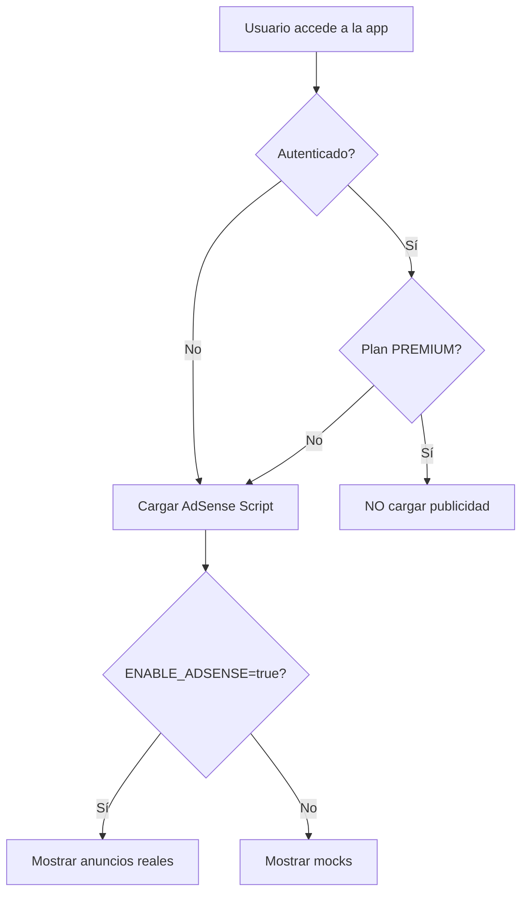

# 📢 Implementación de Google AdSense

> **Sprint**: Monetización con Google AdSense
> **Fecha**: 2026-02-10
> **Estado**: ✅ Implementado

---

## 📋 Tabla de Contenidos

1. [Resumen Ejecutivo](#resumen-ejecutivo)
2. [Arquitectura](#arquitectura)
3. [Configuración de Variables de Entorno](#configuración-de-variables-de-entorno)
4. [Componentes Implementados](#componentes-implementados)
5. [Guía de Integración](#guía-de-integración)
6. [Ejemplos de Uso](#ejemplos-de-uso)
7. [Testing y Desarrollo](#testing-y-desarrollo)
8. [Despliegue a Producción](#despliegue-a-producción)
9. [Troubleshooting](#troubleshooting)

---

## 🎯 Resumen Ejecutivo

Se ha implementado un sistema completo de monetización con **Google AdSense** que:

- ✅ **Carga condicional**: Script de AdSense solo se carga para usuarios FREE
- ✅ **Premium Support**: Usuarios PREMIUM no ven publicidad
- ✅ **Modo Mock**: Desarrollo local con placeholders (sin consumir cuota)
- ✅ **Componentes Reutilizables**: Sistema modular de banners
- ✅ **Type-Safe**: TypeScript con definiciones de entorno completas
- ✅ **Performance**: Carga optimizada con `next/script` strategy `afterInteractive`
- ✅ **Dark Mode**: Soporte completo para tema oscuro

---

## 🏗️ Arquitectura

### **Componentes Principales**

```
frontend/
├── components/ads/
│   ├── adsense-script.tsx    # Carga global del script de AdSense
│   ├── ad-banner.tsx          # Componente reutilizable de banners
│   └── index.ts               # Exportaciones públicas
├── types/
│   └── env.d.ts               # Definiciones TypeScript para env vars
└── .env.example               # Template de configuración
```

### **Flujo de Carga**



---

## 🔧 Configuración de Variables de Entorno

### **1. Actualización de `frontend/.env.example`**

```bash
# =========================================================================
# PUBLICIDAD (Google AdSense)
# =========================================================================
# Set to 'true' in production to show real ads. 'false' shows mocks.
NEXT_PUBLIC_ENABLE_ADSENSE=false

# Your AdSense Publisher ID (e.g., ca-pub-1234567890123456)
NEXT_PUBLIC_ADSENSE_CLIENT_ID=ca-pub-xxxxxxxxxxxxxxxx
```

### **2. Definiciones TypeScript (`frontend/types/env.d.ts`)**

```typescript
declare namespace NodeJS {
  interface ProcessEnv {
    // ... otras variables

    // Google AdSense Configuration
    /**
     * Enable/disable AdSense ads
     * - 'true': Show real ads (production)
     * - 'false': Show mock ads (development)
     */
    NEXT_PUBLIC_ENABLE_ADSENSE: string;

    /**
     * AdSense Publisher ID
     * Format: ca-pub-xxxxxxxxxxxxxxxx
     */
    NEXT_PUBLIC_ADSENSE_CLIENT_ID: string;
  }
}
```

### **3. Configuración Local**

```bash
# Copiar el template
cp frontend/.env.example frontend/.env.local

# Editar .env.local
NEXT_PUBLIC_ENABLE_ADSENSE=false  # false en desarrollo
NEXT_PUBLIC_ADSENSE_CLIENT_ID=ca-pub-1234567890123456  # Tu ID real
```

---

## 🧩 Componentes Implementados

### **1. `AdSenseScript` - Carga Global del Script**

**Ubicación**: `frontend/components/ads/adsense-script.tsx`

**Responsabilidad**: Cargar el script de Google AdSense de forma condicional en toda la aplicación.

**Características**:
- ✅ Carga solo una vez (global)
- ✅ Verifica plan del usuario (FREE vs PREMIUM)
- ✅ Usa `next/script` con `strategy="afterInteractive"`
- ✅ Maneja estados de carga (auth + profile)
- ✅ Logs informativos para debugging

**Props**: Ninguna (componente auto-contenido)

**Lógica de decisión**:
```typescript
// NO cargar si:
- ENABLE_ADSENSE !== 'true'
- Client ID no configurado
- Usuario es PREMIUM

// Cargar si:
- Usuario es FREE o no autenticado
- AdSense habilitado
- Client ID configurado
```

**Código de integración**:
```tsx
import { AdSenseScript } from '@/components/ads';

// En app/layout.tsx (dentro de AuthProvider)
<AuthProvider>
  <AdSenseScript />
  {children}
</AuthProvider>
```

---

### **2. `AdBanner` - Componente Reutilizable de Banners**

**Ubicación**: `frontend/components/ads/ad-banner.tsx`

**Responsabilidad**: Renderizar banners de publicidad en ubicaciones específicas.

**Props**:
```typescript
interface AdBannerProps {
  dataAdSlot: string;        // ID del slot de AdSense (ej: "1234567890")
  format?: AdFormat;         // 'auto' | 'fluid' | 'rectangle'
  className?: string;        // Clases Tailwind para estilos
  mockLabel?: string;        // Texto descriptivo para modo mock
}
```

**Características**:
- ✅ Múltiples instancias permitidas
- ✅ Modos: REAL (producción) y MOCK (desarrollo)
- ✅ Verificación de plan PREMIUM
- ✅ Responsive y personalizable
- ✅ Manejo de errores con try-catch
- ✅ Prevención de doble inicialización

**Estados del componente**:

| Usuario | `ENABLE_ADSENSE` | Client ID | Resultado |
|---------|------------------|-----------|-----------|
| PREMIUM | `true` | ✅ | ❌ **No renderiza** (null) |
| FREE | `false` | ✅ | 🎨 **Mock** (placeholder gris) |
| FREE | `true` | ❌ | ⚠️ **Advertencia** (config error) |
| FREE | `true` | ✅ | ✅ **Real** (anuncio de AdSense) |
| No auth | `true` | ✅ | ✅ **Real** (anuncio de AdSense) |

**Modo MOCK (desarrollo)**:
```tsx
// Renderiza un placeholder estilizado
<div className="bg-gray-100 dark:bg-gray-800 border-dashed">
  <p>Espacio Publicitario</p>
  <p>{mockLabel}</p>
  <p>(Modo desarrollo - AdSense deshabilitado)</p>
</div>
```

**Modo REAL (producción)**:
```tsx
<ins
  className="adsbygoogle"
  style={{ display: 'block' }}
  data-ad-client={clientId}
  data-ad-slot={dataAdSlot}
  data-ad-format={format}
  data-full-width-responsive="true"
/>

// Con useEffect para inicializar:
useEffect(() => {
  window.adsbygoogle = window.adsbygoogle || [];
  window.adsbygoogle.push({});
}, [dataAdSlot, format]);
```

---

## 📦 Guía de Integración

### **Paso 1: Integrar `AdSenseScript` en Layout**

**Archivo**: `frontend/app/layout.tsx`

```tsx
import { AdSenseScript } from '@/components/ads';

export default function RootLayout({ children }) {
  return (
    <html lang="es" suppressHydrationWarning>
      <body>
        <SentryProvider>
          <ThemeProvider>
            <QueryProvider>
              <GlobalErrorBoundary>
                <AuthProvider>
                  {/* ↓ AÑADIR AQUÍ (solo una vez) */}
                  <AdSenseScript />

                  {children}
                  <Toaster />
                  <ScrollToTop />
                  <Footer />
                  <CookieBanner />
                </AuthProvider>
              </GlobalErrorBoundary>
            </QueryProvider>
          </ThemeProvider>
        </SentryProvider>
      </body>
    </html>
  );
}
```

**⚠️ Importante**:
- Debe estar **dentro de `<AuthProvider>`** (necesita contexto de autenticación)
- Solo **UNA instancia** en toda la app
- Colocar **antes de `{children}`** para carga temprana

---

### **Paso 2: Añadir Banners en Páginas Específicas**

#### **Ejemplo 1: Banner en el Header**

```tsx
// components/layout/header.tsx
import { AdBanner } from '@/components/ads';

export function Header() {
  return (
    <header className="border-b">
      <div className="max-w-7xl mx-auto px-4 py-4">
        <h1 className="text-2xl font-bold">Verity News</h1>

        {/* Banner horizontal superior */}
        <AdBanner
          dataAdSlot="1234567890"
          format="auto"
          className="my-4"
          mockLabel="Banner Superior"
        />
      </div>
    </header>
  );
}
```

#### **Ejemplo 2: Banner en el Sidebar**

```tsx
// components/layout/sidebar.tsx
import { AdBanner } from '@/components/ads';

export function Sidebar() {
  return (
    <aside className="w-80 space-y-6">
      <nav>{/* Menú de navegación */}</nav>

      {/* Banner rectangular sticky */}
      <AdBanner
        dataAdSlot="9876543210"
        format="rectangle"
        className="sticky top-4"
        mockLabel="Sidebar Publicidad"
      />

      <div>{/* Más contenido */}</div>
    </aside>
  );
}
```

#### **Ejemplo 3: Banner Entre Artículos**

```tsx
// app/page.tsx
import { AdBanner } from '@/components/ads';

export default function HomePage({ articles }) {
  return (
    <main className="max-w-4xl mx-auto p-6">
      <div className="space-y-6">
        {/* Primeros 3 artículos */}
        {articles.slice(0, 3).map(article => (
          <ArticleCard key={article.id} article={article} />
        ))}

        {/* Banner fluido entre artículos */}
        <AdBanner
          dataAdSlot="5555555555"
          format="fluid"
          className="my-8"
          mockLabel="Publicidad entre noticias"
        />

        {/* Resto de artículos */}
        {articles.slice(3).map(article => (
          <ArticleCard key={article.id} article={article} />
        ))}
      </div>
    </main>
  );
}
```

#### **Ejemplo 4: Banner en Página de Detalle**

```tsx
// app/news/[id]/page.tsx
import { AdBanner } from '@/components/ads';

export default async function ArticlePage({ params }) {
  const article = await getArticle(params.id);

  return (
    <article className="max-w-4xl mx-auto p-6">
      <h1 className="text-4xl font-bold mb-4">{article.title}</h1>

      <p className="text-lg text-gray-600 mb-6">
        {article.description}
      </p>

      {/* Banner adaptable después del primer párrafo */}
      <AdBanner
        dataAdSlot="7777777777"
        format="auto"
        className="my-6"
        mockLabel="Banner Artículo"
      />

      <div className="prose max-w-none">
        {article.content}
      </div>
    </article>
  );
}
```

---

## 🎨 Ejemplos de Uso

### **Formatos de Anuncios**

#### **1. Auto (Adaptable)**
```tsx
<AdBanner
  dataAdSlot="1234567890"
  format="auto"  // Se adapta al espacio disponible
  className="w-full"
  mockLabel="Banner Adaptable"
/>
```
**Uso recomendado**: Headers, footers, entre contenido

---

#### **2. Rectangle (Rectángulo Fijo)**
```tsx
<AdBanner
  dataAdSlot="1234567890"
  format="rectangle"  // 300x250 típicamente
  className="w-[300px] h-[250px]"
  mockLabel="Banner Rectangular"
/>
```
**Uso recomendado**: Sidebars, widgets

---

#### **3. Fluid (Fluido)**
```tsx
<AdBanner
  dataAdSlot="1234567890"
  format="fluid"  // Se ajusta al contenedor
  className="w-full min-h-[200px]"
  mockLabel="Banner Fluido"
/>
```
**Uso recomendado**: In-feed ads, entre listas

---

### **Personalización de Estilos**

```tsx
{/* Banner de ancho completo con sombra */}
<AdBanner
  dataAdSlot="1234567890"
  className="w-full shadow-lg rounded-xl p-4 bg-white dark:bg-gray-900"
  mockLabel="Banner Estilizado"
/>

{/* Banner sticky en sidebar */}
<AdBanner
  dataAdSlot="9876543210"
  format="rectangle"
  className="sticky top-20 z-10"
  mockLabel="Sticky Ad"
/>

{/* Banner con animación de entrada */}
<AdBanner
  dataAdSlot="5555555555"
  className="animate-fade-in opacity-0 animation-delay-1000"
  mockLabel="Animated Banner"
/>
```

---

## 🧪 Testing y Desarrollo

### **Modo Desarrollo (Mock)**

```bash
# .env.local
NEXT_PUBLIC_ENABLE_ADSENSE=false
NEXT_PUBLIC_ADSENSE_CLIENT_ID=ca-pub-test123456
```

**Comportamiento**:
- ✅ Muestra placeholders grises con bordes punteados
- ✅ No consume cuota de AdSense
- ✅ No requiere aprobación de cuenta
- ✅ Texto descriptivo: "Espacio Publicitario - {mockLabel}"

**Ventajas**:
- Desarrollo rápido sin dependencias externas
- Visualización de ubicaciones de anuncios
- Testing de layout y responsive sin datos reales

---

### **Modo Producción (Real)**

```bash
# .env.local (para testing local con anuncios reales)
NEXT_PUBLIC_ENABLE_ADSENSE=true
NEXT_PUBLIC_ADSENSE_CLIENT_ID=ca-pub-1234567890123456  # Tu ID real
```

**Comportamiento**:
- ✅ Carga script de AdSense
- ✅ Muestra anuncios reales (si la cuenta está aprobada)
- ⚠️ Consumirá impresiones reales

**Testing con usuarios PREMIUM**:
```typescript
// Verificar en consola:
// "📢 AdSense: Usuario PREMIUM → NO mostrar anuncios"

// El componente debe retornar null y no renderizar nada
```

---

### **Logs de Debug**

El sistema incluye logs informativos:

```javascript
// Logs del AdSenseScript
"📢 AdSense: Deshabilitado en variables de entorno"
"⚠️ AdSense: Client ID no configurado correctamente"
"📢 AdSense: Esperando autenticación..."
"📢 AdSense: Usuario no autenticado → Mostrar anuncios"
"📢 AdSense: Usuario FREE → Mostrar anuncios"
"📢 AdSense: Usuario PREMIUM → NO mostrar anuncios"
"✅ AdSense: Script cargado correctamente"
"❌ AdSense: Error al cargar script: [error]"

// Logs del AdBanner
"✅ AdSense: Banner inicializado { slot: '1234567890', format: 'auto' }"
"❌ AdSense: Error al inicializar banner: [error]"
```

---

## 🚀 Despliegue a Producción

### **1. Obtener Cuenta de Google AdSense**

1. Ve a [Google AdSense](https://www.google.com/adsense)
2. Crea una cuenta o inicia sesión
3. Añade tu dominio de producción
4. Espera aprobación (puede tardar 1-3 días)

---

### **2. Crear Unidades de Anuncios**

En el dashboard de AdSense:

1. **Anuncios** → **Por unidad de anuncios** → **Crear nueva unidad**
2. Selecciona el tipo:
   - **Anuncio gráfico** → format="rectangle"
   - **Anuncio in-feed** → format="fluid"
   - **Anuncio adaptable** → format="auto"
3. Dale un nombre descriptivo (ej: "Banner Superior Homepage")
4. Copia el **ID del slot** (ej: `1234567890`)
5. Usa ese ID en `dataAdSlot`

---

### **3. Configurar Variables en Vercel/Netlify**

#### **Vercel**:
```bash
# Dashboard → Project Settings → Environment Variables

# Producción
NEXT_PUBLIC_ENABLE_ADSENSE=true
NEXT_PUBLIC_ADSENSE_CLIENT_ID=ca-pub-1234567890123456

# Preview (opcional - usar mocks)
NEXT_PUBLIC_ENABLE_ADSENSE=false
NEXT_PUBLIC_ADSENSE_CLIENT_ID=ca-pub-1234567890123456
```

#### **Netlify**:
```bash
# Site Settings → Environment variables

NEXT_PUBLIC_ENABLE_ADSENSE=true
NEXT_PUBLIC_ADSENSE_CLIENT_ID=ca-pub-1234567890123456
```

---

### **4. Validar Implementación**

Después del despliegue:

1. **Verifica el script en producción**:
   ```html
   <!-- Debe estar presente en el <head> -->
   <script
     src="https://pagead2.googlesyndication.com/pagead/js/adsbygoogle.js?client=ca-pub-1234567890123456"
     crossorigin="anonymous"
   ></script>
   ```

2. **Verifica los banners**:
   ```html
   <!-- Deben estar presentes los <ins> tags -->
   <ins class="adsbygoogle"
        style="display:block"
        data-ad-client="ca-pub-1234567890123456"
        data-ad-slot="1234567890"
        data-ad-format="auto">
   </ins>
   ```

3. **Usa las herramientas de AdSense**:
   - Dashboard → **Sitios** → Verificar que tu dominio esté activo
   - **Anuncios** → Ver impresiones en tiempo real

---

### **5. Políticas y Compliance**

⚠️ **Importante**: Google AdSense tiene políticas estrictas.

**Cumplir con**:
- ✅ **Política de contenido**: No contenido prohibido (adulto, violencia, etc.)
- ✅ **Política de clics**: No incentivar clics falsos
- ✅ **GDPR/Privacy**: Incluir consentimiento de cookies (ya implementado con `CookieBanner`)
- ✅ **Ubicación de anuncios**: No más de 3 anuncios por página recomendado
- ✅ **Contenido original**: No sitios copiados o scraped

**Recursos**:
- [Políticas de AdSense](https://support.google.com/adsense/answer/48182)
- [Guía de optimización](https://support.google.com/adsense/answer/9183549)

---

## 🐛 Troubleshooting

### **Problema: Script no se carga**

**Síntomas**: No aparece el script en el HTML

**Soluciones**:
1. Verificar `NEXT_PUBLIC_ENABLE_ADSENSE=true`
2. Verificar que el Client ID no sea el placeholder `ca-pub-xxxxxxxxxxxxxxxx`
3. Verificar logs en consola:
   ```javascript
   console.log(process.env.NEXT_PUBLIC_ENABLE_ADSENSE);
   console.log(process.env.NEXT_PUBLIC_ADSENSE_CLIENT_ID);
   ```
4. Verificar que `<AdSenseScript />` esté dentro de `<AuthProvider>`

---

### **Problema: Banners no renderizan**

**Síntomas**: Los banners no aparecen o muestran advertencia

**Soluciones**:
1. **Usuario PREMIUM**: Comportamiento esperado (no debe mostrar ads)
2. **Client ID inválido**: Configura el ID real en `.env.local`
3. **AdSense deshabilitado**: Cambiar `ENABLE_ADSENSE=true` para modo real
4. **Error de inicialización**: Revisar logs de consola para errores de `adsbygoogle.push()`

---

### **Problema: Anuncios vacíos en producción**

**Síntomas**: Los `<ins>` están en el DOM pero no muestran contenido

**Causas comunes**:
1. **Cuenta de AdSense no aprobada**: Esperar aprobación (1-3 días)
2. **Slot ID incorrecto**: Verificar que el ID del slot sea correcto
3. **Dominio no verificado**: Añadir el dominio en AdSense dashboard
4. **Bloqueador de anuncios**: Desactivar extensiones de bloqueador de ads
5. **Políticas violadas**: Revisar estado de la cuenta en AdSense

**Debug**:
```javascript
// En consola del navegador:
console.log(window.adsbygoogle);
// Debe mostrar array con los anuncios pusheados

// Verificar errores de AdSense:
// Ver Network tab → Filtrar por "adsbygoogle"
```

---

### **Problema: Rendimiento degradado**

**Síntomas**: Página carga lenta después de añadir AdSense

**Soluciones**:
1. **Verificar strategy**: Debe ser `afterInteractive` (ya implementado)
2. **Lazy loading**: Para banners en el footer, considerar `strategy="lazyOnload"`
3. **Limitar cantidad**: No más de 3-4 banners por página
4. **Profiling**: Usar Chrome DevTools → Performance para identificar bottlenecks

---

### **Problema: Dark mode no funciona en mocks**

**Síntomas**: Los mocks no cambian de color en modo oscuro

**Solución**: Los estilos ya incluyen dark mode con `dark:bg-gray-800`, verificar que el ThemeProvider esté funcionando correctamente.

---

## 📊 Mejores Prácticas

### **1. Ubicación de Anuncios**

**Recomendaciones de Google**:
- ✅ **Above the fold**: Un banner en la parte superior (mayor visibilidad)
- ✅ **In-content**: Banners entre párrafos o artículos (mejor engagement)
- ✅ **Sidebar**: Banner sticky en el lateral (persistente sin intrusivo)
- ❌ **Evitar**: Más de 3 anuncios por página inicial

---

### **2. Formatos Recomendados**

| Ubicación | Formato | Dimensiones típicas |
|-----------|---------|---------------------|
| Header | `auto` | Ancho completo, altura variable |
| Sidebar | `rectangle` | 300x250 o 300x600 |
| In-feed | `fluid` | Se adapta al contenedor |
| Footer | `auto` | Ancho completo, altura variable |

---

### **3. Optimización de Rendimiento**

```tsx
// ✅ BUENO: Lazy load banners en el footer
<AdBanner
  dataAdSlot="1234567890"
  format="auto"
  className="mt-12"
  mockLabel="Footer Banner"
/>

// ❌ MALO: Demasiados banners en la misma página
<AdBanner dataAdSlot="111" />
<AdBanner dataAdSlot="222" />
<AdBanner dataAdSlot="333" />
<AdBanner dataAdSlot="444" />  // Demasiados
<AdBanner dataAdSlot="555" />  // Puede afectar rendimiento
```

---

### **4. Testing Multiplataforma**

Probar en:
- ✅ Desktop (Chrome, Firefox, Safari)
- ✅ Mobile (iOS Safari, Android Chrome)
- ✅ Tablets
- ✅ Con/sin bloqueadores de anuncios
- ✅ Con/sin JavaScript habilitado

---

### **5. Monitoreo Post-Despliegue**

**Métricas clave**:
- **Impresiones**: Número de veces que se carga un anuncio
- **CTR (Click-Through Rate)**: % de clics sobre impresiones
- **RPM (Revenue Per Mille)**: Ingresos por cada 1000 impresiones
- **Fill Rate**: % de solicitudes de anuncios satisfechas

**Herramientas**:
- Google AdSense Dashboard
- Google Analytics (integrar con AdSense)
- Sentry (para errores de script)

---

## 📚 Referencias

- [Google AdSense - Documentación Oficial](https://support.google.com/adsense)
- [Next.js Script Component](https://nextjs.org/docs/app/api-reference/components/script)
- [AdSense Policies](https://support.google.com/adsense/answer/48182)
- [AdSense Optimization Guide](https://support.google.com/adsense/answer/9183549)

---

## ✅ Checklist de Implementación

### **Desarrollo**
- [x] Configurar variables de entorno en `.env.example`
- [x] Crear definiciones TypeScript en `types/env.d.ts`
- [x] Implementar componente `AdSenseScript`
- [x] Implementar componente `AdBanner`
- [x] Integrar `AdSenseScript` en `layout.tsx`
- [ ] Añadir banners en páginas específicas (según necesidad)
- [ ] Testing con usuarios FREE y PREMIUM
- [ ] Testing responsive (mobile, tablet, desktop)

### **Producción**
- [ ] Crear cuenta de Google AdSense
- [ ] Añadir dominio de producción
- [ ] Esperar aprobación de cuenta (1-3 días)
- [ ] Crear unidades de anuncios (slots)
- [ ] Configurar variables en Vercel/Netlify
- [ ] Desplegar a producción
- [ ] Validar script en producción
- [ ] Verificar impresiones en AdSense Dashboard
- [ ] Monitorear rendimiento (Core Web Vitals)
- [ ] Revisar cumplimiento de políticas

---

## 📝 Notas Finales

- **Seguridad**: Las variables `NEXT_PUBLIC_*` son públicas (se exponen en el navegador), esto es esperado y seguro para AdSense
- **Privacy**: La integración respeta GDPR con el `CookieBanner` existente
- **Escalabilidad**: El sistema está diseñado para soportar múltiples slots sin duplicar lógica
- **Mantenimiento**: Centralizar configuración en `.env` facilita cambios futuros

---

**Implementado por**: Claude Sonnet 4.5
**Fecha de documentación**: 2026-02-10
**Versión**: 1.0
