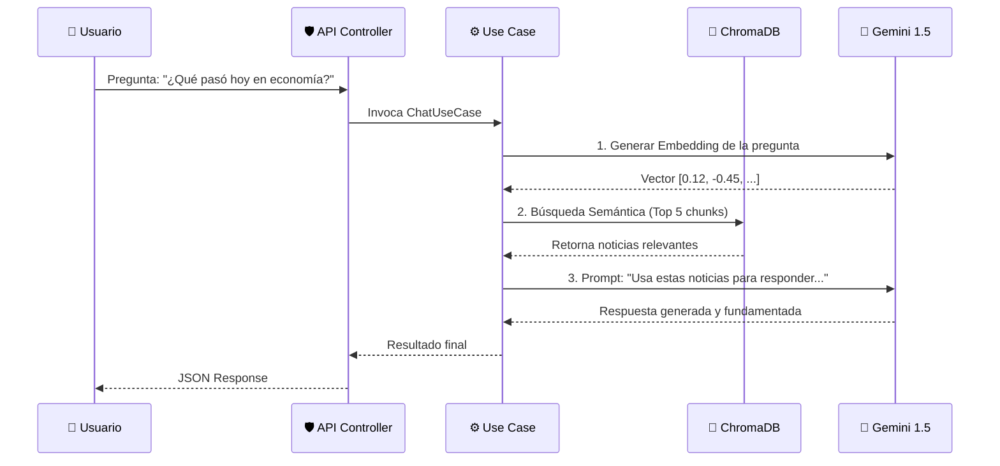

# 🏛️ Documentación de Arquitectura - Verity News

Este documento detalla las decisiones de diseño, patrones y estructura del proyecto **Verity News**. El objetivo principal de la arquitectura elegida es garantizar la **mantenibilidad**, **testabilidad** y la **independencia de la tecnología** (frameworks y bases de datos).

---

## 1. Patrón Arquitectónico: Arquitectura Hexagonal (Ports & Adapters)

Hemos implementado una variante estricta de la Arquitectura Hexagonal combinada con principios de **Domain-Driven Design (DDD)**. Esto permite aislar la lógica de negocio (el "Qué") de los detalles de implementación (el "Cómo").

### Estructura de Capas (`backend/src`)

El código se organiza en tres círculos concéntricos, respetando la Regla de Dependencia (las capas internas no conocen a las externas):

#### 🟢 1. Domain (Núcleo)
* **Ubicación:** `src/domain`
* **Responsabilidad:** Contiene las reglas de negocio puras y las definiciones de tipos.
* **Dependencias:** CERO. No depende de frameworks, ni de bases de datos, ni de librerías externas.
* **Componentes:**
    * **Entities:** `NewsArticle`, `User`. Objetos con identidad y ciclo de vida.
    * **Repository Interfaces (Puertos):** `NewsRepository`, `UserRepository`. Contratos que definen cómo se guardan los datos, sin implementar el guardado real.
    * **Errors:** Excepciones de dominio específicas (`DomainError`).

#### 🟡 2. Application (Orquestación)
* **Ubicación:** `src/application`
* **Responsabilidad:** Coordina la interacción entre el mundo exterior y el dominio. Implementa los Casos de Uso del sistema.
* **Dependencias:** Solo depende de la capa de Dominio.
* **Componentes:**
    * **Use Cases:** `IngestNewsUseCase`, `ChatGeneralUseCase`. Contienen la lógica de aplicación (ej: "Cuando llega una noticia, analízala con IA y guárdala").

#### 🔴 3. Infrastructure (Adaptadores)
* **Ubicación:** `src/infrastructure`
* **Responsabilidad:** Implementar los detalles técnicos. Aquí "viven" los frameworks.
* **Dependencias:** Depende de Dominio y Aplicación.
* **Componentes:**
    * **HTTP:** Controladores Express, Routers, Middlewares.
    * **Persistence:** Implementaciones de Prisma (`PrismaNewsRepository`) y ChromaDB.
    * **External:** Clientes para APIs de terceros (Gemini, NewsAPI, Firebase).

---

## 2. Diagrama de Flujo de Datos (RAG Pipeline)

El corazón de Verity News es su motor RAG (Retrieval Augmented Generation). Así fluye la información:

---

## 3. Observabilidad IA (estado actual)

La observabilidad IA ya cubre Fase 1 (core comun) y Fase 2 (instrumentacion persistente de operaciones IA de Verity), con persistencia de runs, versionado de prompts y calculo de coste en micros EUR.

Referencias:

- [AI Observability Phase 1](AI_OBSERVABILITY_PHASE_1.md)
- [AI Observability Phase 2](AI_OBSERVABILITY_PHASE_2.md)
- [Plan oficial de la feature (MBA)](../../media-bias-atlas/docs/PLAN_FEATURE_AI_OBSERVABILITY_AUDIT.md)
- [Sprint 11 - Fase 1 Observabilidad IA (MBA)](../../media-bias-atlas/docs/SPRINT_11_AI_OBSERVABILITY_FASE_1.md)
- [Informe acumulado de sprints MBA](../../media-bias-atlas/docs/MEDIA_BIAS_ATLAS_INFORME_SPRINTS.md)
