# Arquitectura Hexagonal - Verity News

> Documentación de la estructura de capas del backend

## Descripción

Verity News implementa una **Arquitectura Hexagonal** (también conocida como Ports & Adapters o Clean Architecture) que separa claramente las responsabilidades en tres capas concéntricas:

1. **Domain (Núcleo)**: Entidades y reglas de negocio puras
2. **Application**: Casos de uso y orquestación
3. **Infrastructure**: Adaptadores a tecnologías externas

## Diagrama de Arquitectura

```mermaid
flowchart TB
    subgraph External["🌐 Mundo Exterior"]
        Client["🖥️ Cliente Web<br/>(Next.js)"]
        RSS["📡 RSS Feeds<br/>(9 medios españoles)"]
        GeminiAPI["🤖 Gemini API<br/>(Análisis + Embeddings)"]
        PostgreSQL[("🐘 PostgreSQL<br/>(Prisma 7)")]
        ChromaDB[("🔮 ChromaDB<br/>(Vectores 768d)")]
        JinaAPI["📄 Jina Reader API<br/>(Scraping)"]
    end

    subgraph Infrastructure["📦 INFRASTRUCTURE LAYER"]
        direction TB

        subgraph HTTP["HTTP Adapters"]
            Routes["🛤️ Routes<br/>Express Router"]
            Controllers["🎮 Controllers<br/>Request/Response"]
            Schemas["✅ Schemas<br/>Zod Validation"]
        end

        subgraph Persistence["Persistence Adapters"]
            PrismaRepo["💾 PrismaNewsArticleRepository<br/>Implementa INewsArticleRepository"]
        end

        subgraph ExternalAdapters["External API Adapters"]
            GeminiClient["🧠 GeminiClient<br/>Implementa IGeminiClient"]
            ChromaClient["🔍 ChromaClient<br/>Implementa IChromaClient"]
            JinaClient["📰 JinaReaderClient<br/>Implementa IJinaReaderClient"]
            RSSClient["📡 DirectSpanishRssClient<br/>Implementa INewsAPIClient"]
            MetadataExt["🖼️ MetadataExtractor<br/>og:image extraction"]
        end

        subgraph Config["Configuration"]
            DI["⚙️ DependencyContainer<br/>Singleton IoC"]
            Server["🚀 Express Server<br/>CORS, Rate Limit"]
        end
    end

    subgraph Application["⚡ APPLICATION LAYER"]
        direction TB
        UC1["📥 IngestNewsUseCase<br/>Ingesta RSS → DB"]
        UC2["🔬 AnalyzeArticleUseCase<br/>Scraping + Gemini + ChromaDB"]
        UC3["💬 ChatArticleUseCase<br/>RAG + Grounding"]
        UC4["🔎 SearchNewsUseCase<br/>Búsqueda semántica"]
        UC5["⭐ ToggleFavoriteUseCase<br/>Gestión favoritos"]
    end

    subgraph Domain["💎 DOMAIN LAYER (Núcleo)"]
        direction TB

        subgraph Entities["Entities"]
            NewsArticle["📰 NewsArticle<br/>Entidad principal"]
            ArticleAnalysis["📊 ArticleAnalysis<br/>Value Object"]
            TokenUsage["💰 TokenUsage<br/>Value Object"]
        end

        subgraph Ports["Ports (Interfaces)"]
            IRepo["📋 INewsArticleRepository"]
            IGemini["🤖 IGeminiClient"]
            IChroma["🔮 IChromaClient"]
            IJina["📄 IJinaReaderClient"]
            INews["📡 INewsAPIClient"]
        end

        subgraph Errors["Domain Errors"]
            DomainErr["❌ ValidationError<br/>EntityNotFoundError"]
            InfraErr["⚠️ ExternalAPIError<br/>DatabaseError"]
        end
    end

    %% Conexiones Externas → Infrastructure
    Client <-->|"HTTP/JSON"| Routes
    RSS -->|"XML/RSS"| RSSClient
    GeminiAPI <-->|"REST API"| GeminiClient
    PostgreSQL <-->|"Prisma Client"| PrismaRepo
    ChromaDB <-->|"HTTP API"| ChromaClient
    JinaAPI <-->|"REST API"| JinaClient

    %% Infrastructure → Application
    Controllers --> UC1
    Controllers --> UC2
    Controllers --> UC3
    Controllers --> UC4
    Controllers --> UC5

    %% Application → Domain (via Ports)
    UC1 -.->|"usa"| IRepo
    UC1 -.->|"usa"| INews
    UC2 -.->|"usa"| IRepo
    UC2 -.->|"usa"| IGemini
    UC2 -.->|"usa"| IJina
    UC2 -.->|"usa"| IChroma
    UC3 -.->|"usa"| IRepo
    UC3 -.->|"usa"| IGemini
    UC3 -.->|"usa"| IChroma
    UC4 -.->|"usa"| IRepo
    UC4 -.->|"usa"| IGemini
    UC4 -.->|"usa"| IChroma
    UC5 -.->|"usa"| IRepo

    %% Infrastructure implementa Ports
    PrismaRepo -.->|"implementa"| IRepo
    GeminiClient -.->|"implementa"| IGemini
    ChromaClient -.->|"implementa"| IChroma
    JinaClient -.->|"implementa"| IJina
    RSSClient -.->|"implementa"| INews

    %% Estilos
    classDef domain fill:#e1f5fe,stroke:#01579b,stroke-width:2px
    classDef application fill:#fff3e0,stroke:#e65100,stroke-width:2px
    classDef infrastructure fill:#f3e5f5,stroke:#4a148c,stroke-width:2px
    classDef external fill:#e8f5e9,stroke:#1b5e20,stroke-width:2px

    class NewsArticle,ArticleAnalysis,TokenUsage,IRepo,IGemini,IChroma,IJina,INews,DomainErr,InfraErr domain
    class UC1,UC2,UC3,UC4,UC5 application
    class Routes,Controllers,Schemas,PrismaRepo,GeminiClient,ChromaClient,JinaClient,RSSClient,MetadataExt,DI,Server infrastructure
    class Client,RSS,GeminiAPI,PostgreSQL,ChromaDB,JinaAPI external
```



## Estructura de Directorios

```
backend/src/
├── domain/                          # 💎 CAPA DE DOMINIO
│   ├── entities/
│   │   └── news-article.entity.ts   # Entidad + Value Objects
│   ├── repositories/
│   │   └── news-article.repository.ts # Interface del repositorio
│   ├── services/
│   │   ├── gemini-client.interface.ts
│   │   ├── chroma-client.interface.ts
│   │   ├── jina-reader-client.interface.ts
│   │   └── news-api-client.interface.ts
│   └── errors/
│       ├── domain.error.ts          # ValidationError, EntityNotFoundError
│       └── infrastructure.error.ts  # ExternalAPIError, DatabaseError
│
├── application/                     # ⚡ CAPA DE APLICACIÓN
│   └── use-cases/
│       ├── ingest-news.usecase.ts
│       ├── analyze-article.usecase.ts
│       ├── chat-article.usecase.ts
│       ├── search-news.usecase.ts
│       ├── toggle-favorite.usecase.ts
│       └── get-favorites.usecase.ts
│
└── infrastructure/                  # 📦 CAPA DE INFRAESTRUCTURA
    ├── config/
    │   └── dependencies.ts          # Contenedor IoC (Singleton)
    ├── http/
    │   ├── server.ts                # Express + Middleware
    │   ├── routes/
    │   │   ├── news.routes.ts
    │   │   ├── ingest.routes.ts
    │   │   ├── analyze.routes.ts
    │   │   ├── chat.routes.ts
    │   │   └── search.routes.ts
    │   ├── controllers/
    │   │   ├── news.controller.ts
    │   │   ├── ingest.controller.ts
    │   │   ├── analyze.controller.ts
    │   │   ├── chat.controller.ts
    │   │   └── search.controller.ts
    │   └── schemas/
    │       ├── ingest.schema.ts     # Validación Zod
    │       ├── analyze.schema.ts
    │       └── chat.schema.ts
    ├── persistence/
    │   └── prisma-news-article.repository.ts
    └── external/
        ├── gemini.client.ts         # Gemini 2.5 Flash
        ├── chroma.client.ts         # ChromaDB
        ├── jina-reader.client.ts    # Scraping
        ├── direct-spanish-rss.client.ts
        ├── google-news-rss.client.ts
        ├── newsapi.client.ts
        └── metadata-extractor.ts    # og:image
```

## Principios Aplicados

### 1. Dependency Inversion Principle (DIP)
- Las capas internas (Domain, Application) **no dependen** de las externas
- Los Use Cases dependen de **interfaces** (Ports), no de implementaciones
- La inyección de dependencias se realiza en `DependencyContainer`

### 2. Single Responsibility Principle (SRP)
- Cada Use Case tiene una única responsabilidad
- Los Controllers solo manejan HTTP
- Los Adapters solo adaptan tecnologías externas

### 3. Open/Closed Principle (OCP)
- Se pueden añadir nuevos clientes de noticias sin modificar los Use Cases
- Cambiar de ChromaDB a Pinecone solo requiere un nuevo adapter

## Flujo de Datos Típico

```
HTTP Request
    ↓
Routes (Express)
    ↓
Controllers (valida con Zod)
    ↓
Use Cases (lógica de negocio)
    ↓
Domain Entities (validación de dominio)
    ↓
Ports/Interfaces
    ↓
Adapters (Prisma, Gemini, ChromaDB...)
    ↓
Servicios Externos
```
