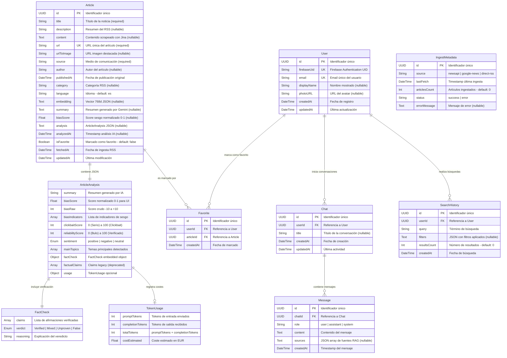

# Diagrama Entidad-Relación (ERD) - Verity News

> Generado a partir de `backend/prisma/schema.prisma` y `domain/entities/news-article.entity.ts`

## Descripción

Este diagrama muestra el modelo de datos completo de Verity News, incluyendo:
- **Entidad principal**: `Article` con campos de análisis IA
- **Value Objects JSON**: `ArticleAnalysis`, `FactCheck`, `TokenUsage`
- **Enumerados**: Categorías, Sentiment, Verdict
- **Relaciones**: User → Favorites, Chat → Messages

---

## Diagrama ERD Principal



---

## Enumerados del Sistema


---

## Estructura JSON: ArticleAnalysis

El campo `Article.analysis` almacena un JSON con la siguiente estructura:

```json
{
  "summary": "Resumen de 2-3 frases generado por Gemini",
  "biasScore": 0.3,
  "biasRaw": -3,
  "biasIndicators": [
    "Uso de adjetivos valorativos",
    "Énfasis en aspectos negativos"
  ],
  "clickbaitScore": 25,
  "reliabilityScore": 85,
  "sentiment": "negative",
  "mainTopics": ["economía", "inflación", "BCE"],
  "factCheck": {
    "claims": [
      "La inflación alcanzó el 3.5% en enero",
      "El BCE mantiene los tipos de interés"
    ],
    "verdict": "Verified",
    "reasoning": "Datos oficiales del INE y comunicado del BCE"
  },
  "factualClaims": ["claim1", "claim2"],
  "usage": {
    "promptTokens": 1234,
    "completionTokens": 456,
    "totalTokens": 1690,
    "costEstimated": 0.000223
  }
}
```

---

## Índices de Rendimiento (PostgreSQL)

| Tabla | Campo | Tipo | Propósito |
|-------|-------|------|-----------|
| `articles` | `publishedAt` | B-tree | Ordenación cronológica |
| `articles` | `source` | B-tree | Filtrado por medio |
| `articles` | `category` | B-tree | Filtrado por categoría |
| `articles` | `analyzedAt` | B-tree | Identificar pendientes de análisis |
| `search_history` | `userId` | B-tree | Historial por usuario |
| `search_history` | `createdAt` | B-tree | Ordenación temporal |
| `messages` | `chatId` | B-tree | Mensajes por conversación |

---

## Constraints y Validaciones

### Unique Constraints
- `Article.url` - Evita duplicados de noticias
- `User.firebaseUid` - Un usuario por cuenta Firebase
- `User.email` - Un email por usuario
- `Favorite(userId, articleId)` - Un favorito por usuario/artículo

### Cascade Delete
- `User` → elimina `Favorite`, `SearchHistory`, `Chat`
- `Article` → elimina `Favorite`
- `Chat` → elimina `Message`

### Defaults
- `Article.language` = `"es"`
- `Article.isFavorite` = `false`
- `Article.fetchedAt` = `now()`
- `SearchHistory.resultsCount` = `0`
- `IngestMetadata.articlesCount` = `0`

---

## Notas para la Memoria TFM

1. **Desnormalización controlada**: El campo `analysis` almacena JSON para evitar JOINs costosos en lecturas frecuentes.

2. **Token Taximeter** (Sprint 8.2): El campo `usage` dentro de `ArticleAnalysis` permite auditar costes de IA por artículo.

3. **Escalabilidad**: Los índices en `publishedAt`, `source` y `category` optimizan las queries más frecuentes del frontend.

4. **Soft vs Hard Delete**: Se usa Cascade Delete para mantener integridad referencial. No hay soft delete implementado.
