# Diagrama de Secuencia: Análisis de Noticia

> Flujo completo del proceso de análisis IA de un artículo

## Descripción

Este diagrama muestra el flujo completo cuando un usuario solicita analizar una noticia, incluyendo:
- Validación de entrada
- Verificación de caché
- Scraping de contenido
- Análisis con Gemini
- Indexación en ChromaDB
- Persistencia en PostgreSQL

## Diagrama de Secuencia

```mermaid
sequenceDiagram
    autonumber
    participant Client as 🖥️ Cliente Web
    participant API as 🛤️ Express Router
    participant Controller as 🎮 AnalyzeController
    participant Zod as ✅ Zod Schema
    participant UseCase as ⚡ AnalyzeArticleUseCase
    participant Repo as 💾 PrismaRepository
    participant DB as 🐘 PostgreSQL
    participant Jina as 📄 Jina Reader
    participant Meta as 🖼️ MetadataExtractor
    participant Gemini as 🤖 Gemini 2.5 Flash
    participant Chroma as 🔮 ChromaDB

    %% ==========================================
    %% FASE 1: REQUEST Y VALIDACIÓN
    %% ==========================================
    rect rgb(230, 245, 255)
        Note over Client,Zod: FASE 1: Request y Validación
        Client->>+API: POST /api/analyze/article<br/>{ articleId: "uuid" }
        API->>+Controller: analyzeArticle(req, res)
        Controller->>+Zod: parse(req.body)
        alt Validación fallida
            Zod-->>Controller: ZodError
            Controller-->>Client: 400 Bad Request
        else Validación OK
            Zod-->>-Controller: { articleId }
        end
    end

    %% ==========================================
    %% FASE 2: BÚSQUEDA Y CACHÉ
    %% ==========================================
    rect rgb(255, 243, 224)
        Note over Controller,DB: FASE 2: Búsqueda y Verificación de Caché
        Controller->>+UseCase: execute({ articleId })
        UseCase->>+Repo: findById(articleId)
        Repo->>+DB: SELECT * FROM articles WHERE id = ?
        DB-->>-Repo: Article row
        Repo-->>-UseCase: NewsArticle entity

        alt Artículo no encontrado
            UseCase-->>Controller: EntityNotFoundError
            Controller-->>Client: 404 Not Found
        else Artículo encontrado
            UseCase->>UseCase: Verificar isAnalyzed

            alt Ya analizado (CACHE HIT)
                Note over UseCase: ⏭️ Gemini NO llamado
                UseCase->>UseCase: getParsedAnalysis()
                UseCase-->>Controller: Cached analysis
                Controller-->>Client: 200 OK + cached data
            else No analizado (CACHE MISS)
                Note over UseCase: Continuar con análisis...
            end
        end
    end

    %% ==========================================
    %% FASE 3: SCRAPING DE CONTENIDO
    %% ==========================================
    rect rgb(232, 245, 233)
        Note over UseCase,Jina: FASE 3: Scraping de Contenido
        UseCase->>UseCase: Verificar contenido existente

        alt Contenido insuficiente (<100 chars)
            UseCase->>+Jina: scrapeUrl(article.url)
            Jina->>Jina: Fetch + Parse HTML
            alt Scraping exitoso
                Jina-->>-UseCase: { content, imageUrl }
                UseCase->>Repo: save(articleWithContent)
                Repo->>DB: UPDATE articles SET content = ?
            else Scraping fallido
                Jina-->>UseCase: Error
                Note over UseCase: FALLBACK: título + descripción
            end
        end
    end

    %% ==========================================
    %% FASE 4: EXTRACCIÓN DE IMAGEN
    %% ==========================================
    rect rgb(243, 229, 245)
        Note over UseCase,Meta: FASE 4: Extracción de Imagen (opcional)
        alt Artículo sin imagen
            UseCase->>+Meta: extractMetadata(url)
            Meta->>Meta: Fetch og:image (timeout 2s)
            Meta-->>-UseCase: { ogImage, twitterImage }
            UseCase->>UseCase: getBestImageUrl()
            opt Imagen encontrada
                UseCase->>Repo: save(articleWithImage)
                Repo->>DB: UPDATE articles SET urlToImage = ?
            end
        end
    end

    %% ==========================================
    %% FASE 5: ANÁLISIS CON GEMINI
    %% ==========================================
    rect rgb(255, 235, 238)
        Note over UseCase,Gemini: FASE 5: Análisis IA con Gemini
        UseCase->>+Gemini: analyzeArticle({ title, content, source })

        Note over Gemini: 🧾 TOKEN TAXIMETER<br/>Tokens entrada + salida<br/>Coste estimado EUR

        Gemini->>Gemini: Prompt optimizado<br/>(~300 tokens instrucción)
        Gemini->>Gemini: generateContent()

        alt Rate limit (429)
            Gemini->>Gemini: Retry con backoff (3 intentos)
        end

        Gemini-->>-UseCase: ArticleAnalysis + TokenUsage
        Note over UseCase: ✅ biasScore, summary,<br/>clickbaitScore, reliabilityScore,<br/>sentiment, factCheck
    end

    %% ==========================================
    %% FASE 6: PERSISTENCIA Y AUTO-FAVORITO
    %% ==========================================
    rect rgb(255, 253, 231)
        Note over UseCase,DB: FASE 6: Persistencia
        UseCase->>UseCase: article.withAnalysis(analysis)
        UseCase->>UseCase: Auto-mark as favorite ⭐
        UseCase->>+Repo: save(analyzedArticle)
        Repo->>+DB: UPDATE articles SET<br/>summary, biasScore, analysis,<br/>analyzedAt, isFavorite = true
        DB-->>-Repo: OK
        Repo-->>-UseCase: Updated NewsArticle
    end

    %% ==========================================
    %% FASE 7: INDEXACIÓN VECTORIAL
    %% ==========================================
    rect rgb(224, 247, 250)
        Note over UseCase,Chroma: FASE 7: Indexación Vectorial
        UseCase->>+Gemini: generateEmbedding(textToEmbed)
        Gemini-->>-UseCase: float[768]

        UseCase->>+Chroma: upsertItem(id, embedding, metadata)
        Chroma->>Chroma: Store vector + metadata
        Chroma-->>-UseCase: OK

        Note over UseCase: 🔍 Artículo ahora buscable<br/>por similitud semántica
    end

    %% ==========================================
    %% FASE 8: RESPUESTA
    %% ==========================================
    rect rgb(230, 245, 255)
        Note over UseCase,Client: FASE 8: Respuesta al Cliente
        UseCase-->>-Controller: AnalyzeArticleOutput

        Controller-->>-API: res.json({ success, data })
        API-->>-Client: 200 OK<br/>{<br/>  articleId,<br/>  summary,<br/>  biasScore,<br/>  analysis: ArticleAnalysis<br/>}
    end
```

## Descripción de Fases

### Fase 1: Request y Validación
- El cliente envía una petición POST con el `articleId`
- Zod valida el formato del UUID
- Si falla, se devuelve 400 Bad Request

### Fase 2: Búsqueda y Caché
- Se busca el artículo en PostgreSQL
- **COST OPTIMIZATION**: Si ya está analizado, se devuelve el caché sin llamar a Gemini
- Esto evita pagar dos veces por el mismo análisis

### Fase 3: Scraping de Contenido
- Si el contenido es insuficiente (<100 chars), se usa Jina Reader
- **FALLBACK**: Si el scraping falla, se usa título + descripción
- El contenido scrapeado se guarda para futuros análisis

### Fase 4: Extracción de Imagen
- Si el artículo no tiene imagen, se extrae `og:image` de la URL
- Timeout de 2 segundos para no bloquear el análisis
- No es un error crítico si falla

### Fase 5: Análisis IA
- Gemini 2.5 Flash analiza el contenido
- **TOKEN TAXIMETER**: Se registra el consumo de tokens y coste
- Retry automático con backoff exponencial si hay rate limit

### Fase 6: Persistencia
- Se guarda el análisis en PostgreSQL
- **AUTO-FAVORITO**: El artículo se marca como favorito automáticamente

### Fase 7: Indexación Vectorial
- Se genera un embedding de 768 dimensiones
- Se indexa en ChromaDB para búsqueda semántica
- No es bloqueante: si falla, el análisis ya está completo

### Fase 8: Respuesta
- Se devuelve el análisis completo al cliente
- Incluye: summary, biasScore, clickbaitScore, reliabilityScore, etc.

## Métricas de Rendimiento

| Fase | Latencia Típica | Crítica |
|------|-----------------|---------|
| Validación | <5ms | No |
| Búsqueda DB | 10-50ms | Sí |
| Scraping | 1-3s | Sí |
| Metadata | 0.5-2s | No |
| **Gemini** | **2-8s** | **Sí** |
| Persistencia | 20-100ms | Sí |
| ChromaDB | 50-200ms | No |

**Total estimado**: 4-12 segundos (dominado por Gemini)
